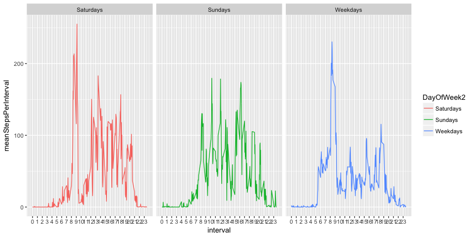

# Reproducible Research Project 1 
Petra Stone  
3/3/2017  


## Loading and preprocessing the data

Load and unzip the data:


```r
    if (!file.exists("activity.csv")) {
        download.file("https://d396qusza40orc.cloudfront.net/repdata%2Fdata%2Factivity.zip",
                      destfile = "activity.zip")
        unzip("activity.zip", zipfile="activity.csv")
    }
    data <- read.csv( "activity.csv" )
```
 
 Basic summaries:
 

```r
    summary(data)
```

```
##      steps                date          interval     
##  Min.   :  0.00   2012-10-01:  288   Min.   :   0.0  
##  1st Qu.:  0.00   2012-10-02:  288   1st Qu.: 588.8  
##  Median :  0.00   2012-10-03:  288   Median :1177.5  
##  Mean   : 37.38   2012-10-04:  288   Mean   :1177.5  
##  3rd Qu.: 12.00   2012-10-05:  288   3rd Qu.:1766.2  
##  Max.   :806.00   2012-10-06:  288   Max.   :2355.0  
##  NA's   :2304     (Other)   :15840
```

```r
    str(data)
```

```
## 'data.frame':	17568 obs. of  3 variables:
##  $ steps   : int  NA NA NA NA NA NA NA NA NA NA ...
##  $ date    : Factor w/ 61 levels "2012-10-01","2012-10-02",..: 1 1 1 1 1 1 1 1 1 1 ...
##  $ interval: int  0 5 10 15 20 25 30 35 40 45 ...
```

Convert the date and time columns to dates and interval to factor:


```r
    data$dateTime <- as.POSIXct(paste(data$date, sprintf("%04d", data$interval)), format="%Y-%m-%d %H%M")
    data$date <- as.Date(data$date)
    data$interval <- as.factor(data$interval)
```

## What is mean total number of steps taken per day?


```r
    require(dplyr)

    stepsPerDay <- data %>%
        group_by(date) %>%
        summarise(totalSteps=sum(steps, na.rm=T), totalIntervals=n())
    
    head( stepsPerDay )
```

```
## # A tibble: 6 × 3
##         date totalSteps totalIntervals
##       <date>      <int>          <int>
## 1 2012-10-01          0            288
## 2 2012-10-02        126            288
## 3 2012-10-03      11352            288
## 4 2012-10-04      12116            288
## 5 2012-10-05      13294            288
## 6 2012-10-06      15420            288
```

```r
    mean( stepsPerDay$totalSteps )
```

```
## [1] 9354.23
```

```r
    median( stepsPerDay$totalSteps )
```

```
## [1] 10395
```

## What is the average daily activity pattern?

We already know that mean steps per day is 9354 and median steps per day is 10395. Let's look more into the steps per day and the intervals ie. the 288 timestamps which were recorded each of 61 days:

Steps per day:


```r
    require(ggplot2)
    require(gridExtra)
    summary(stepsPerDay)
```

```
##       date              totalSteps    totalIntervals
##  Min.   :2012-10-01   Min.   :    0   Min.   :288   
##  1st Qu.:2012-10-16   1st Qu.: 6778   1st Qu.:288   
##  Median :2012-10-31   Median :10395   Median :288   
##  Mean   :2012-10-31   Mean   : 9354   Mean   :288   
##  3rd Qu.:2012-11-15   3rd Qu.:12811   3rd Qu.:288   
##  Max.   :2012-11-30   Max.   :21194   Max.   :288
```

```r
    p1 <- ggplot(stepsPerDay, aes(x="All Days", y=totalSteps) ) +
        geom_boxplot() + xlab("") +
        geom_hline( aes(yintercept = mean( stepsPerDay$totalSteps ), colour="mean")) +
        geom_hline( aes(yintercept = median( stepsPerDay$totalSteps ), colour="median") ) +
        scale_color_manual(name="",values=c("red","blue")) 
    
    p2 <- ggplot(stepsPerDay, aes(x=totalSteps) ) +
        geom_histogram() + xlab("Total Steps Per Day") +
        geom_vline( aes(xintercept = mean( stepsPerDay$totalSteps ), colour="mean")) +
        geom_vline( aes(xintercept = median( stepsPerDay$totalSteps ), colour="median")) +
        scale_color_manual(name="",values=c("red","blue")) 
    
    grid.arrange(p1,p2,ncol=2)
```


The distibution of steps per day is a little skewed and bimodal with the mode value being zero steps and the median greater than the mean. 
 
Steps per Interval:


```r
    stepsPerInterval <- data %>%
        group_by(interval) %>%
        summarise(totalSteps=sum(steps, na.rm=T), meanStepsPerInterval=mean(steps, na.rm=T))

    summary(stepsPerInterval)
```

```
##     interval     totalSteps      meanStepsPerInterval
##  0      :  1   Min.   :    0.0   Min.   :  0.000     
##  5      :  1   1st Qu.:  131.8   1st Qu.:  2.486     
##  10     :  1   Median : 1808.0   Median : 34.113     
##  15     :  1   Mean   : 1981.3   Mean   : 37.383     
##  20     :  1   3rd Qu.: 2800.2   3rd Qu.: 52.835     
##  25     :  1   Max.   :10927.0   Max.   :206.170     
##  (Other):282
```

```r
    p1 <- ggplot(stepsPerInterval, 
                 aes(x="All Intervals", y=meanStepsPerInterval) ) +
        geom_boxplot() + xlab("")
    
     p2 <- ggplot( stepsPerInterval, 
                   aes(y=meanStepsPerInterval, x=interval, alpha=.5) ) +
            geom_point() +
            scale_x_discrete(labels=rep(0:23), breaks=seq(0,2355, by=100))
     
    grid.arrange(p1,p2,ncol=2)
```


    
## Imputing missing values

First let's check what % of the data is NA:


```r
    paste0(round(mean( is.na(data) )*100,2),"%")
```

```
## [1] "3.28%"
```

Substitute the NA values for steps with the mean for the given interval:


```r
    # Assign the mean per interval to the NAs
    imputed <- left_join(data, subset(stepsPerInterval, select=-c(totalSteps)) )
    imputed$steps[is.na(imputed$steps)] <- imputed$meanStepsPerInterval
    
    imputedStepsPerDay <- imputed %>%
        group_by(date) %>%
        summarise(totalSteps=sum(steps))
    summary(imputedStepsPerDay)
```

```
##       date              totalSteps   
##  Min.   :2012-10-01   Min.   :   41  
##  1st Qu.:2012-10-16   1st Qu.: 9819  
##  Median :2012-10-31   Median :10766  
##  Mean   :2012-10-31   Mean   :10766  
##  3rd Qu.:2012-11-15   3rd Qu.:12811  
##  Max.   :2012-11-30   Max.   :21194
```

Plot the new distribution and mean and median:


```r
    ggplot( imputedStepsPerDay, aes(x=totalSteps) ) +
        geom_histogram() +
        geom_vline( aes(xintercept = mean( imputedStepsPerDay$totalSteps ), colour="mean")) +
        geom_vline( aes(xintercept = median( imputedStepsPerDay$totalSteps ), colour="median") ) +
        scale_color_manual(name="",values=c("red","blue")) +
        ggtitle("Total Steps per day\nusing imputed mean of interval for NA values of steps")
```


The mean and median are now equal to each other and the distribution appears more normal:


```r
    summary(imputedStepsPerDay)
```

```
##       date              totalSteps   
##  Min.   :2012-10-01   Min.   :   41  
##  1st Qu.:2012-10-16   1st Qu.: 9819  
##  Median :2012-10-31   Median :10766  
##  Mean   :2012-10-31   Mean   :10766  
##  3rd Qu.:2012-11-15   3rd Qu.:12811  
##  Max.   :2012-11-30   Max.   :21194
```


## Are there differences in activity patterns between weekdays and weekends?


```r
    require(Hmisc)
    imputed$DayOfWeek <- factor( 
        ifelse( !weekdays(imputed$date) %in% c("Saturday","Sunday"), "weekday", "weekend") 
    )
    
    panels <- imputed %>%
        group_by(interval,
                 DayOfWeek) %>%
        summarise(meanStepsPerInterval=mean(steps))
    
    ggplot(panels, 
            aes(x=interval, y=meanStepsPerInterval, color=DayOfWeek, group=DayOfWeek)) +
        geom_line() +
        scale_x_discrete(labels=rep(0:23), breaks=seq(0,2355, by=100)) 
```


* The graph for weekends does not have the same extreme peak in mean steps as we see on weekdays between 8am and 9am.
* For the 5am to 8am window there is more activity on weekdays.
* On weekends there are more peaks in activity between 8am and 21pm than weekdays.
* On weekends there is a peak in activity between 20pm and 21pm which does not exist on weekdays.

We might be interested in comparing Saturday to Sunday:


```r
    imputed$DayOfWeek2 <- factor( 
        ifelse( !weekdays(imputed$date) %in% c("Saturday","Sunday"), "Weekdays", 
                ifelse(weekdays(imputed$date)=="Saturday", "Saturdays", "Sundays") ) 
    )
    
    panels2 <- imputed %>%
        group_by(interval,
                 DayOfWeek2) %>%
        summarise(meanStepsPerInterval=mean(steps))
    
    ggplot(panels2, 
            aes(x=interval, y=meanStepsPerInterval, color=DayOfWeek2, group=DayOfWeek2)) +
        geom_line() +
        scale_x_discrete(labels=rep(0:23), breaks=seq(0,2355, by=100)) +
        facet_grid(~DayOfWeek2)
```


* We can see that Saturday looks a lot different that Sunday. 
* It even surpasses the early morning peak for weekdays.
